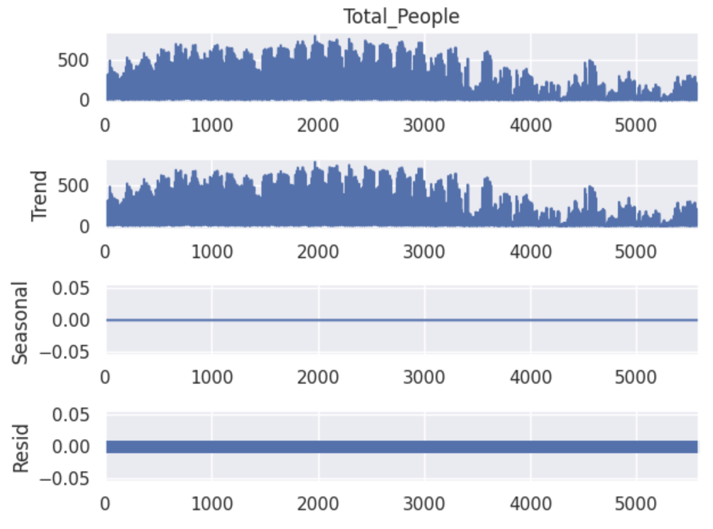
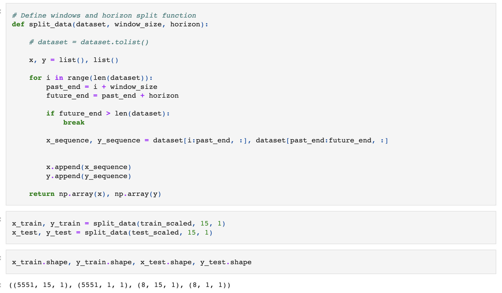
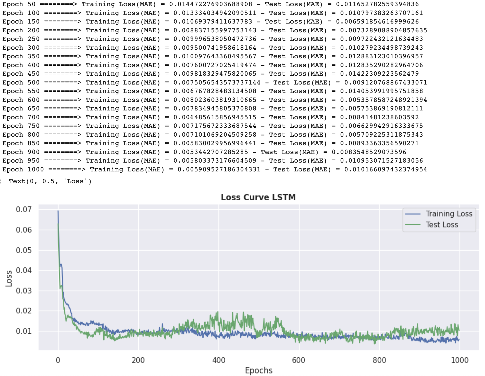
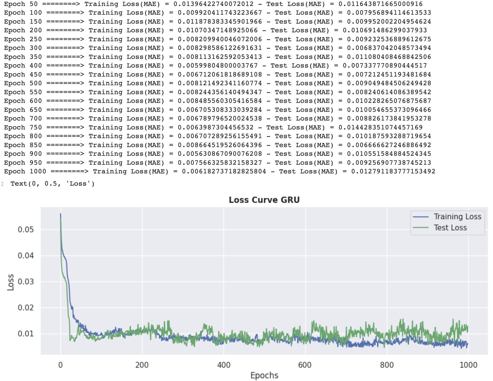
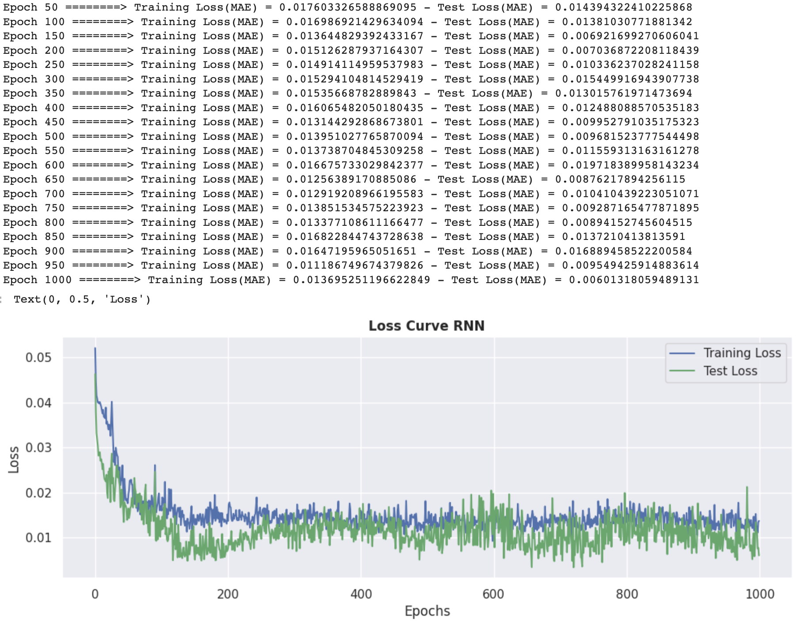
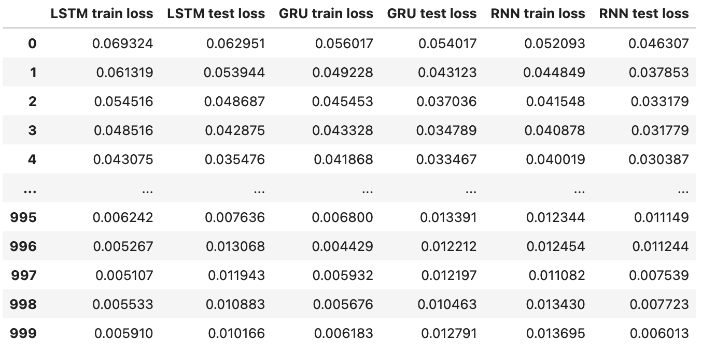
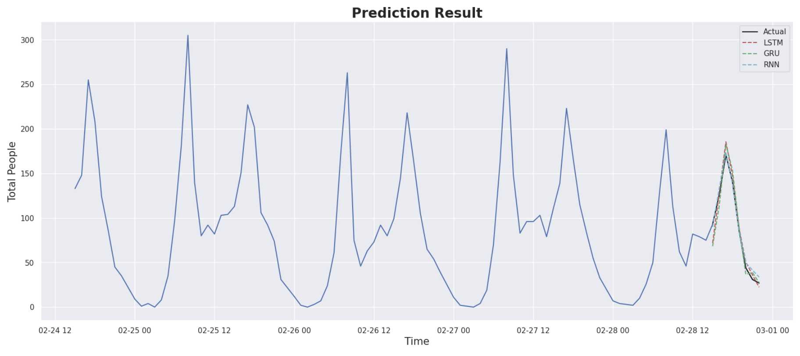
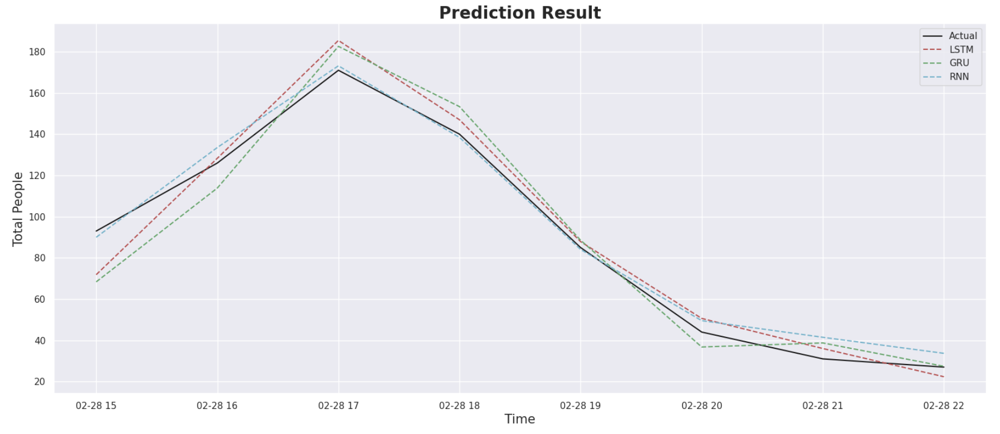

# **Citi Bike Forecasting**

## **Project Goal**
The aim of this project is to create machine learning model that able to forecast total people in certain area. I used citi bike data because this is open source and contains a lot of data.

## **Step of Work**
### **1. Data Extraction**
In this step, i downloaded citi bike dataset from this [link](https://citibikenyc.com/system-data). Because this data divided into some csv files, so i concatenated them into one csv file. Here i show dataframe of this dataset.
<pre>

</pre>
This data contain up to 5 million + rows which is showed like this.
<pre>

</pre>
### **2. Data Preprocessing (Feature Engineering and Exploratory Data Analysis)**
In this step, i did some manipulation tasks to change data format. Each data point in raw data show person that has been used bicycle (it can be known with starttime and stoptime columns) at each specific area in america. My idea of this case is to group users on each hour every day based on users stoptime. I used this idea simply because i think stoptime means that bicycle were at station on that stoptime, so i can easily assumed that users also at there on that time. I have taken +- 5 minutes of users stoptime to be considered (example on 01:00, i have taken data from 00:55 ~ 01:05) because there are very less data which have stoptime exactly on specific hour that i want. I also remove all stations and only considered all of these users are in america area.
<pre>
</pre>
After feature engineering, i did exploratory data analysis to get information from data. Because this is time series data, so i used seasonal decomposition method to analyze trend, seasonal, and residual from the data. Here seasonal decomposition graph of the data.
<pre>

</pre>
### **3. Model Building**
In this model building step, first i separated the data into train and test split. I used last 1 month to best test data. After that, this data are scaled by min max scaler that i have developed by myself. Then, i split again these data into window and horizon type like this.
<pre>

</pre>
Furthermore, i created time series forecasting model with 3 different algorithms, LSTM, GRU, and RNN. Here i showed the evaluation result of each model.
#### **LSTM**
<pre>

</pre>
#### **GRU**
<pre>

</pre>
#### **RNN**
<pre>

</pre>
Here i showed entire loss values of each algorithm both on train and test data.
<pre>

</pre>
Based on this loss summary, we can see that on last training and testing, **LSTM** obtain best result.
<pre>
</pre>
Here also i showed visualization of prediction result.
<pre>

</pre>
For better view, this i also attached prediction result visualization only on data test.
<pre>

</pre>

