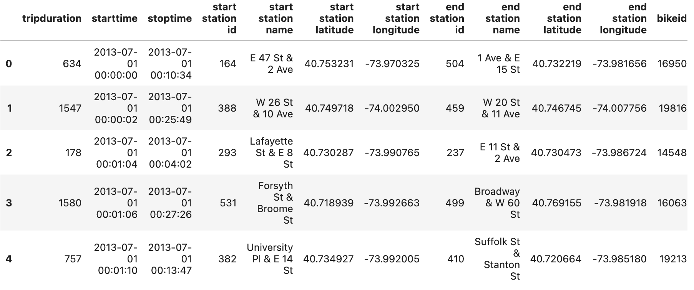
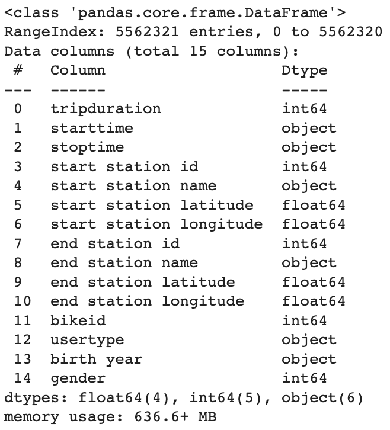

# Citi Bike Forecasting

## Project Goal
The aim of this project is to create machine learning model that able to forecast total people in certain area. I used citi bike data because this is open source and contains a lot of data.

## Step of Work
### 1. Data Extraction
In this step, i downloaded citi bike dataset from this [link](https://citibikenyc.com/system-data). Because this data divided into some csv files, so i concatenated them into one csv file. Here i show dataframe of this dataset.
<pre>

</pre>
This data contain up to 5 million + rows which is showed like this.
<pre>

</pre>
